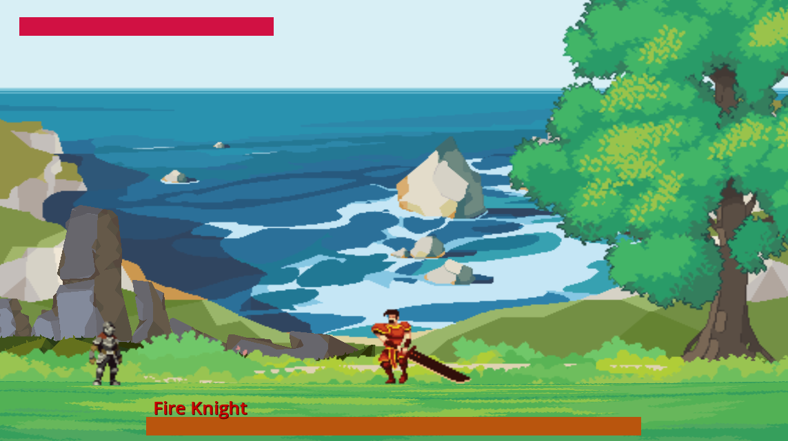
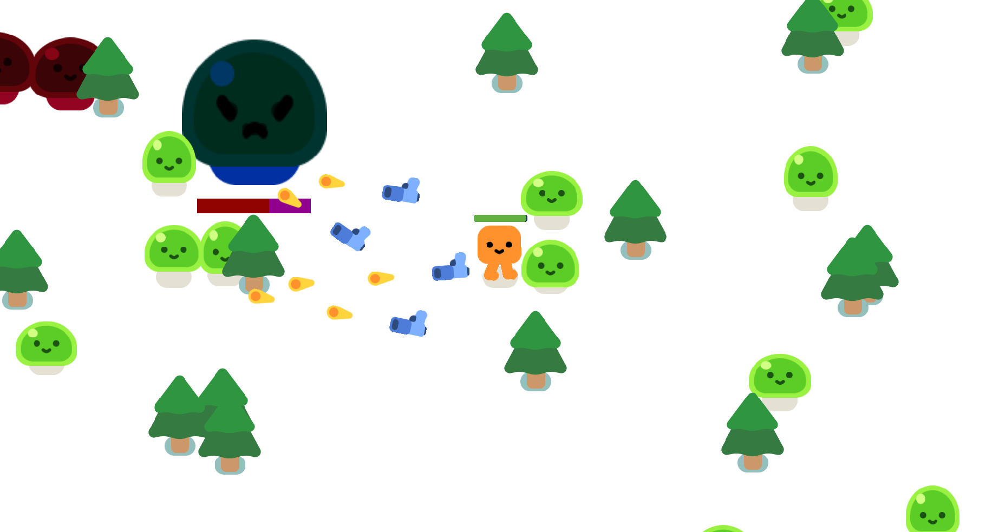
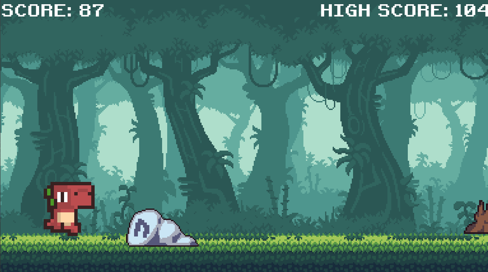
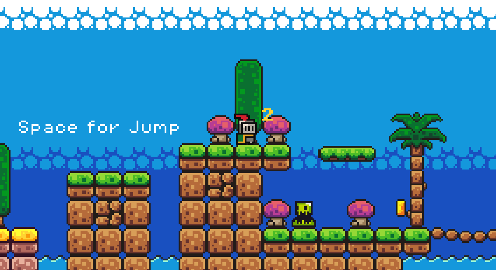

# 2D Boss Fight Demo

## About the Project

This is a simple boss fight demo created with Godot Engine. It showcases a single encounter between a Fire Knight boss and a character. This project serves as a practical study in game development using Godot.

# Jam Horde

## About the Project

"Jam Horde" is a basic 2D horde shooting game developed using the Godot Engine. 
The project began with the tutorial from GDQuest ["Your First 2D GAME From Zero with GODOT 4! Vampire Survivor Style"](https://www.youtube.com/watch?v=GwCiGixlqiU&list=PLFJW8VabOXWmCWcJyWv2ABkwiaZu3I4qB) and has been enhanced with additional features, including new bosses and multiple guns.

# Side Scroller Tutorial Game

## Description

This is a simple side-scroller game created as a tutorial project. You control a character that must jump over obstacles to score points. The goal is to achieve the highest score possible. 
The game was developed following the YouTube tutorial ["How to Make a Google Chrome T-Rex Style Sidescroller In Godot | Beginner Tutorial"](https://www.youtube.com/watch?v=nKBhz6oJYsc&list=PLFJW8VabOXWmCWcJyWv2ABkwiaZu3I4qB&index=2) by Coding With Russ.

# First Godot Game

## About the Project

Simple 2D pixel art parkour game created using the Godot Engine.
This is my first Godot game, developed with guidance from the YouTube tutorial ["How to make a Video Game - Godot Beginner Tutorial"](https://www.youtube.com/watch?v=LOhfqjmasi0&pp=ygUIYnJhY2V5cyA%3D) by Bracey.

